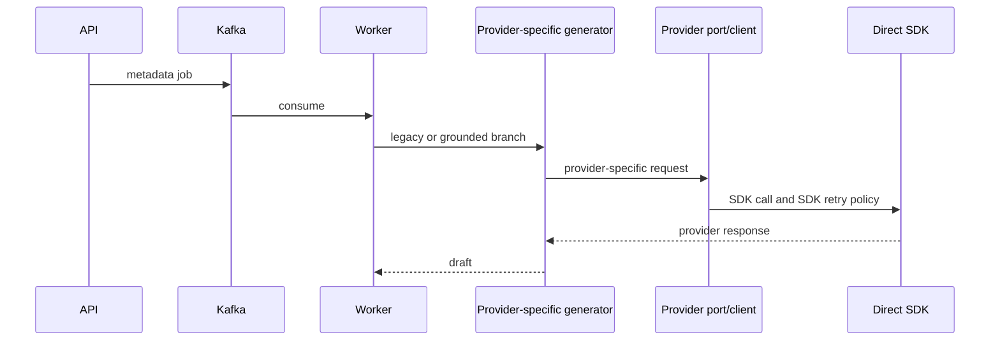

# Spring AI 2 Provider And Trace Architecture

이 문서는 ReadMates의 현재 AI provider 호출, 비용 정산, 복구, privacy, 분산 추적 구조의 living source of truth입니다. 승인 설계 기록은 `docs/superpowers/`에 보존하지만 현재 사실은 코드, 설정, migration, 테스트와 이 문서를 기준으로 판단합니다.

## Before / After

전환 전에는 provider마다 generator, port, client, 직접 SDK 경로가 반복되었고 legacy/grounded pipeline 선택이 worker와 Redis record에 남아 있었습니다.



현재는 application이 모든 호출 정책을 소유하고 Spring AI는 정확히 한 번의 outbound transport/structured-output 변환만 담당합니다.

```mermaid
sequenceDiagram
    participant API as Spring MVC API
    participant R as Redis job/admission
    participant K as Kafka
    participant W as AiGenerationWorker
    participant E as Grounded executor/policy
    participant G as ProviderCallGate
    participant C as GroundedProviderCallCoordinator
    participant L as Redis atomic ledger
    participant S as Spring AI adapter
    participant P as Provider HTTP
    participant V as Validation/evidence
    participant A as MySQL audit
    API->>R: preflight and job payload (TTL 6h)
    API->>K: metadata-only job + W3C context
    K->>W: observed consumer span
    W->>E: grounded-only generation
    E->>G: circuit and semaphore permit
    G-->>E: permit or fail-fast rejection
    E->>C: one physical call command
    C->>L: atomically reserve slot + worst-case cost + IN_FLIGHT
    L-->>C: attempt ordinal or fail closed
    C->>S: one ChatClient call
    S->>P: exactly one non-streaming HTTP request
    P-->>S: structured response / safe failure
    S-->>C: domain output + four-channel usage
    C->>L: ACTUAL or ESTIMATED_UNKNOWN reconciliation
    C->>A: content-free attempt audit + trace ID
    C-->>E: outcome
    E->>V: schema/grounding validation; bounded next decision
    V->>R: validated result/evidence only
```

## Package Boundary And Bean Construction

- Application/domain packages know only `WholeTranscriptGroundedGenerator`, `ProviderCallGate`, `ProviderCallReservationPort`, `AiProviderObservationPort`, `AiTraceContextPort` and ReadMates models.
- `GroundedProviderCallPolicy` owns the pure maximum-three-call state machine. `GroundedProviderCallCoordinator` owns permit -> Redis reservation -> one transport -> reconciliation -> audit.
- `ResilientProviderCallGate` owns a provider-keyed Resilience4j circuit breaker and fail-fast semaphore; rejection reserves neither a slot nor cost.
- `RedisProviderCallReservationAdapter` and `ProviderCallReservationRedisScripts` own the single Lua reservation/reconciliation/recovery boundary.
- `AiGenerationSpringAiConfig` is loaded only for `readmates.aigen.enabled=true` and non-mock execution. It constructs explicit provider `ChatModel` instances and a `Map<Provider, ChatClient>`; Spring's default single-model selection stays disabled.
- `SpringAiWholeTranscriptGroundedGenerator`, `SpringAiProviderOptionsFactory`, `GroundedStructuredOutputConverter`, `SpringAiUsageMapper`, and `SpringAiErrorMapper` are the only provider execution boundary. `validateSchema()` and Spring AI advisors that can retry are not used.
- Disabled-by-default startup needs no provider key. When a provider is enabled, its allowlisted capability and key are mandatory; Google additionally requires the paid-tier retention confirmation flag.

Spring AI modules are versioned only by `org.springframework.ai:spring-ai-bom:2.0.0`. Runtime inspection resolves all Spring AI modules to `2.0.0`, Spring Boot OpenTelemetry to `4.0.6`, Micrometer Tracing to `1.6.5`, and OpenTelemetry SDK/exporter to `1.55.0`. OpenAI, Anthropic and Google SDK artifacts remain only as transitive transports required by the Spring AI model modules; ReadMates has no direct SDK dependency declaration or direct source execution path.

## Removed Boundary Mapping

| Removed type/path | Current replacement or reason |
| --- | --- |
| `ClaudeApiClient`, `OpenAiApiClient`, `GeminiApiClient` | Explicit Spring AI `ChatModel` beans in `AiGenerationSpringAiConfig` |
| `ClaudeApiPort`, `OpenAiApiPort`, `GeminiApiPort` | Spring AI `ChatModel` transport behind `ChatClient` |
| `ClaudeWholeTranscriptGroundedGenerator`, `OpenAiWholeTranscriptGroundedGenerator`, `GeminiWholeTranscriptGroundedGenerator` | One `SpringAiWholeTranscriptGroundedGenerator` configured per provider |
| `ClaudeContentGenerator`, `OpenAiContentGenerator`, `GeminiContentGenerator` | Deleted; legacy generation is not a fallback |
| `ClaudeContentRegenerator`, `OpenAiContentRegenerator`, `GeminiContentRegenerator` | Deleted; grounded section regeneration uses the shared coordinator/policy |
| `SessionContentGenerator`, `SessionContentRegenerator` | Deleted application ports; grounded-only `WholeTranscriptGroundedGenerator` remains |
| `LlmErrorMapper`, `LlmGenerationException` | `SpringAiErrorMapper` and content-safe `ProviderCallException` |
| `LlmPromptBuilder`, `SessionImportSchemaResource` | Grounded renderer, versioned `GroundedGenerationSchemaResource`, and converter |
| Legacy pipeline enum, record field and environment selector | Deleted; no runtime selector or dual execution path |
| SDK retry contract tests and direct-client live tests | Provider mock-HTTP Spring AI contract tests with exact request counts |

`GeminiSchemaCompatAdapter` remains only to reduce the shared schema to Google's supported subset. `DefaultGroundedRequestRenderer`, `GroundedDraftJsonCodec`, validation, evidence projection, Redis payload TTL, commit recovery, provider allowlist and kill switch remain application-owned.

## Provider Contract Matrix

| Provider/model | Request options | Structured output / usage | Retention control | Verified |
| --- | --- | --- | --- | --- |
| OpenAI `gpt-5.4-mini` | non-streaming, `maxCompletionTokens`, `store=false`, model allowlist, SDK `maxRetries=0` | shared versioned JSON schema; generic usage mapped to four channels | `store=false`; operator must re-check provider terms before rollout | adapter contract 2026-07-16 |
| Anthropic `claude-sonnet-4-6` | non-streaming, `maxTokens`, SDK `maxRetries=0`, `SYSTEM_ONLY` prompt cache | `$defs` are inlined for native output schema; native cache creation/read fields map independently | operator must re-check provider terms before rollout | native schema/cache allowlist 2026-07-16 |
| Google `gemini-3-flash-preview` | non-streaming JSON, `thinkingBudget=0`, `includeThoughts=false`, search/tool invocations off, transport attempts 1, Spring retry 0 | Google-compatible schema and extended usage metadata; incomplete breakdown fails closed | paid-tier confirmation flag is mandatory; `x-goog-data-policy: no-retention` is best effort only | no-thinking capability 2026-07-16 |

Model names, capabilities, prices and provider terms can drift. The dates above verify adapter contracts, not a billable live provider response. Live contract calls remain opt-in.

## Physical Calls, Retry, Fallback And Repair

The invariant for every possible network request is:

```text
permit -> atomic Redis reservation -> exactly one HTTP request -> ACTUAL or ESTIMATED_UNKNOWN
```

The gate, expired admission, changed job state, Redis failure, model/config rejection, or proven pre-transport failure consumes zero physical-call slots and zero cost. Once bytes may have been accepted, timeout/reset/response loss/worker crash never releases uncertain cost.

The application state machine counts primary, same-provider retry, cross-provider fallback, schema correction, grounding section repair and user-triggered regeneration in the same maximum of three physical calls. Schema correction and section repair are each single-use; correction/repair is not recursively retried. Transient and rate-limit delays are bounded by configured backoff and `Retry-After`. Spring AI retry is one attempt, OpenAI/Anthropic SDK retry is zero, and Google transport attempts is one. No provider-specific automatic fallback exists.

## Redis Reservation, Cost And Crash Recovery

| Key | Shape / lifetime |
| --- | --- |
| `aigen:job:<jobId>` | content-free job hash, `llmCallCount`, club binding; 6h |
| `aigen:job:<jobId>:provider_attempts` | per-attempt field prefix with ordinal/provider/model/mode/state/reserved cost/basis/safe code/times; 6h |
| `aigen:club:<clubId>:provider_admission` | owner token; 5m and renewed by reservation |
| `aigen:club:<clubId>:monthly_cost_usd` | reserved/reconciled USD counter; 31d |
| `aigen:job:<jobId>:{transcript,turns,result,evidence}` | four permitted content payloads; 6h and deleted on commit/cancel |

One Lua reservation checks the job/status/club binding, live admission owner, three-call cap, monthly cap and single-use modes; it then increments `llmCallCount`, reserves worst-case USD and writes `IN_FLIGHT`. This is atomic only for the current single-node Redis topology. Redis Cluster is unsupported because the keys are not guaranteed to share a hash slot.

Worst-case cost prices estimated input at the higher of normal/cache-write input rates when cache write is possible and reserves full configured output. Reconciliation changes the reservation to `ACTUAL` only when complete usage is available. Unknown or incomplete usage keeps the reserved amount with `ESTIMATED_UNKNOWN`. A proven pre-transport outcome may release slot and cost; an uncertain transport outcome may not.

On Kafka redelivery, a still-live `IN_FLIGHT` attempt is not sent again. After the stale cutoff it becomes `UNKNOWN`/`ESTIMATED_UNKNOWN`, retains its slot/cost, and only a new attempt ID may use a remaining slot. Commit receipt recovery remains the MySQL/Redis cross-store source of truth.

## Token And Audit Contracts

Internal `TokenUsage` has four independent channels: `nonCachedInputTokens`, `cacheWriteInputTokens`, `cacheReadInputTokens`, `outputTokens`. Cost and metrics price them separately. The public REST DTO remains exactly `input`, `cachedInput`, `output`; public input is non-cached plus cache-write, and public cached input is cache-read.

Flyway V38 additively extends `ai_generation_audit_log` with nullable `trace_id`, nullable `provider_attempt`, nullable `provider_call_mode`, non-null `cost_basis` defaulting to `NONE`, and non-null `cache_write_input_tokens` defaulting to 0. Existing session/club/user columns remain because MySQL audit identity is the established authorization/business-audit boundary. That does not authorize copying those identifiers to observability data.

## Trace And Privacy Contract

Spring MVC observations, Spring Kafka producer/consumer observations, the application provider observation and Spring AI/provider client observations use W3C trace context. `RequestIdFilter` remains a separate log lookup ID and does not replace `traceparent`.

AI observation allowlists are low-cardinality `provider`, allowlisted `model`, `callMode`, `outcome`, and safe `errorCode`; trace-only correlation may include `jobId` and attempt ordinal. Logs may include `traceId`, `spanId`, `requestId`, AI `jobId`, provider, stage and attempt. Prompt, completion, transcript, schema body, evidence, raw provider error, member/user ID, session ID, club ID/slug and baggage are forbidden in the AI trace path. HTTP observations drop raw URL high-cardinality tags. The PII scanner and observation tests enforce these boundaries.

Sampling defaults to 100% (`READMATES_TRACING_SAMPLING_PROBABILITY=1.0`). The OTLP exporter is asynchronous and bounded (`max-queue-size=2048`, `max-batch-size=512`, 5s timeout/delay). Export failure increments bounded delivery metrics and cannot fail product work. Tempo retains trace blocks for seven days. Trace data is operational metadata, not a content store.

## Tempo Topology

Local Compose exposes Prometheus, Grafana, Tempo query and OTLP HTTP only on `127.0.0.1`. Tempo receives OTLP on container ports 4317/4318, serves queries/metrics on 3200, and persists WAL/blocks in `readmates-local-tempo`.

OCI Compose attaches server, Prometheus, Grafana and Tempo to the same internal Compose network. Tempo publishes no host port; Grafana alone is loopback-bound for tunnel access. `readmates_tempo_data` persists seven-day data. Prometheus has exemplar storage enabled and scrapes Tempo internally; Grafana provisions Prometheus exemplar links and the internal Tempo datasource. Tempo is not an authentication boundary and must never receive a public port.

## Configuration Changes

Added/current controls include `READMATES_AIGEN_PROVIDER_REQUEST_TIMEOUT` (max 4m), `READMATES_AIGEN_MAX_CONCURRENT_PER_PROVIDER`, transient backoff base/max, `READMATES_AIGEN_GOOGLE_PAID_TIER_RETENTION_CONFIRMED`, four-channel per-model prices, `READMATES_AIGEN_KAFKA_MAX_POLL_INTERVAL` (default 16m), `READMATES_TRACING_SAMPLING_PROBABILITY`, and `READMATES_OTLP_TRACES_ENDPOINT`. Spring AI chat auto-selection and all content/error logging observations are disabled.

The legacy pipeline mode environment control and every runtime selector were removed. Existing kill switch, provider allowlist and three provider key names remain. Key values are never documented or committed.

The 16-minute Kafka maximum poll interval covers three 4-minute provider calls, at most two bounded 30-second delays, validation/persistence margin, and JVM scheduling variance. Startup validation rejects an interval smaller than the configured worst-case processing budget.

## File Inventory

The implementation range inventory (`git diff --name-status origin/main..HEAD -- server ops deploy scripts docs .github`) contains 199 paths: 53 added, 101 modified and 45 deleted before this living-document commit.

| Status | Actual inventory summary |
| --- | --- |
| Added | Spring AI adapter/config files; provider call models/ports/policy/coordinator/gate/Redis scripts; Micrometer/OTLP privacy adapters; V38; provider, Redis, Kafka, architecture and observability tests; Tempo config/datasources/validator; approved spec/plan |
| Modified | `server/build.gradle.kts`, application/config/model/worker/executor/audit/Redis/Kafka/DTO code and tests; `application.yml`, Logback; Prometheus/Grafana/Compose/deploy scripts; active architecture/operations/scripts docs and release checks |
| Deleted | All three provider `*ApiClient`, `*ApiPort`, `*ContentGenerator`, `*ContentRegenerator`, `*WholeTranscriptGroundedGenerator`; legacy common LLM error/prompt/schema helpers; `SessionContentGenerator`/`SessionContentRegenerator`; corresponding direct-SDK/live/legacy tests and stubs |

New production files are exactly the paths under `adapter/out/llm/springai/`, `ProviderRetryAfterExtractor`, the provider-call model/ports/policy/coordinator, resilience/Redis/observability adapters, `AiGenerationSpringAiConfig`, three shared observability classes, V38, `ops/tempo/tempo.yml`, two Tempo datasource files and `scripts/validate-tempo-config.sh`. Removed production files are enumerated in [Removed Boundary Mapping](#removed-boundary-mapping); the 24 removed legacy/direct-provider tests and stubs were replaced by the new Spring AI, policy, Redis, Kafka, architecture and privacy suites. The command above is the authoritative per-path inventory and prevents this narrative grouping from becoming a second stale manifest.

## Verification Evidence

Evidence below was run from the Task 15 working tree based on implementation commit `a0332bb6`. The final documentation commit is identified by `git log -1 --oneline` rather than embedded here because a Git commit cannot contain its own stable hash.

| Command / proof | Result |
| --- | --- |
| Runtime dependency inventory | PASS — Spring AI 2.0.0 converged; no direct provider SDK declaration |
| Static legacy/direct/privacy scans | PASS — no direct provider declaration or source path, no runtime legacy selector, and all 15 AI PII invariants passed |
| `./scripts/server-ci-check.sh` | PASS — unit, architecture, Detekt, ktlint and coverage gates |
| `./server/gradlew -p server integrationTest` | PASS — full Testcontainers integration suite in 2m03s |
| `npx --yes corepack@0.35.0 pnpm --dir front test:e2e` | PASS — 74/74 Playwright tests in 59.4s after installing the pinned Chromium prerequisite |
| Prometheus/Tempo/Grafana validators and local smoke | PASS — rules/config/dashboards validated; synthetic trace queried; exporter failure stayed bounded when Tempo stopped |
| Public release candidate build/check | PASS — candidate built; path/content/Tempo contract checks and gitleaks reported no finding |
| Server release image and Trivy | PASS — arm64 release image built; Trivy 0.70.0 returned 0 for HIGH/CRITICAL with unfixed findings ignored |
| `graphify update .` | PASS — 12,934 nodes, 25,107 edges and 756 communities; 24 data fixtures produced no code nodes and the graph exceeded only the optional HTML visualization limit |
| OpenAI/Anthropic/Google live provider smoke | SKIPPED — requires provider key and billable external call; mock-wire contracts are CI proof |
| Production deploy / secret changes | SKIPPED — outside this implementation and requires operator authorization |

The first full integration attempt exposed that `server/src/test/resources/application.yml` shadowed the main Spring AI disable defaults and therefore attempted Google model auto-configuration without a key. The test profile now disables every Spring AI model category explicitly and a fresh full run passes. The first E2E attempt found no installed Playwright Chromium binary; installing the declared browser prerequisite changed no repository file and the fresh suite passes.

## Residual Risks

- A provider without idempotency can bill a request whose response was lost. Unknown reconciliation and the three-call cap bound but cannot eliminate duplicate billing.
- Conservative `ESTIMATED_UNKNOWN` can close a club budget earlier than actual spend. Any adjustment is an audited operator action, never an automatic refund.
- Anthropic/Google native usage metadata, model capabilities, retention terms and prices can drift after the verification date. Incomplete breakdown fails closed and may require disabling a provider/cache until revalidated.
- 100% sampling and seven-day local Tempo storage can pressure an OCI VM. Monitor disk, Tempo readiness, received spans, exporter failures and queue drops before changing sampling/retention through review.
- Atomic reservation assumes single-node Redis. A Redis Cluster migration requires a new same-slot or transaction design before activation.
- Previous images do not understand grounded-only Redis attempts. Rollback cannot reinterpret active state safely.

## Ordered Rollback

1. Set the AI kill switch off and stop/disable the AI Kafka consumer. Do not route grounded jobs to a legacy path; none exists.
2. Wait for the six-hour AI Redis payload/attempt TTL so old and new images do not share incompatible live state. During an approved urgent incident, delete only the affected `aigen:job:<jobId>*` and bound admission keys after recording audit evidence. Never run a full Redis flush.
3. Roll back the application image to the previous known-good image. V38 is additive and remains; use forward-fix for schema changes rather than destructive migration rollback.
4. Restore only the prior image's supported configuration, verify DB/Redis/Kafka health, then re-enable consumers and AI intentionally. Tempo failure alone does not require product rollback; isolate exporter/Tempo first.
