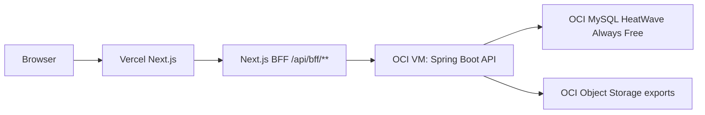

# ReadMates Password Auth And OCI MySQL HeatWave Deployment Design

작성일: 2026-04-20
상태: VALIDATED DESIGN SPEC
문서 목적: ReadMates를 Vercel 프론트엔드, OCI Compute 백엔드, OCI MySQL HeatWave Always Free 관리형 RDB로 배포하기 위해 Google OAuth 대신 초대 기반 이메일/비밀번호 인증을 도입하고, 현재 PostgreSQL 중심 코드를 MySQL 호환 구조로 전환하는 기준을 정의한다.

## 1. 결정 요약

ReadMates의 첫 운영 배포는 Google OAuth를 제거하고 Spring Boot가 직접 인증을 담당한다. RDB는 self-hosted PostgreSQL이 아니라 OCI MySQL HeatWave Always Free를 사용한다.

- 호스트가 초대할 때 이메일, 이름, 역할을 고정한다.
- 초대받은 사용자는 초대 링크에서 고정된 이메일과 이름을 확인하고 비밀번호를 직접 설정한다.
- 이후 로그인은 이메일과 비밀번호로 한다.
- 인증 토큰은 브라우저 JavaScript에 노출하지 않고 `HttpOnly`, `Secure`, `SameSite=Lax` 쿠키로만 전달한다.
- Vercel의 Next.js 앱은 화면과 BFF 역할을 맡는다.
- Spring Boot API는 OCI Compute VM에서 실행한다.
- Spring API는 Vercel BFF가 붙이는 내부 secret을 요구한다. 브라우저가 OCI API를 직접 호출하는 경로는 신뢰하지 않는다.
- DB는 OCI MySQL HeatWave Always Free 관리형 DB system을 사용한다.
- 피드백 문서 원본은 현재처럼 RDB에 저장한다.
- OCI Object Storage는 우선 DB export와 운영 백업 보관소로 사용한다.

이 설계는 무료 운영, 도메인 미보유 상태, 초대제 제품 정책, 관리형 RDB 선호, 장기 운영 부담 감소를 동시에 만족시키는 것을 목표로 한다.

## 2. 무료 RDB 선택

결론: OCI 안에서 무료 관리형 RDB를 쓰려면 ReadMates에는 OCI MySQL HeatWave Always Free가 가장 적합하다.

공식 문서 기준:

- OCI MySQL HeatWave는 Always Free DB system 생성을 지원한다.
- Always Free MySQL DB system은 `MySQL.Free` shape를 사용한다.
- Always Free MySQL storage는 50 GB다.
- Always Free MySQL은 기본 automatic backup 1일 retention을 지원한다.
- Always Free MySQL은 HA, read replica, manual backup, point-in-time recovery를 지원하지 않는다.
- OCI Autonomous Database도 Always Free RDB이지만 Oracle Database 계열이다. ReadMates의 Spring/JDBC/Flyway 구조에는 MySQL 전환이 Oracle DB 전환보다 현실적이다.
- OCI Database with PostgreSQL은 이 설계의 무료 관리형 DB 후보가 아니다.

따라서 선택지는 다음처럼 정리한다.

| 선택지 | 비용 | 운영 편의성 | 코드 변경량 | 판단 |
|---|---:|---:|---:|---|
| OCI MySQL HeatWave Always Free | 무료 | 높음 | 중간-높음 | 선택 |
| OCI VM self-hosted PostgreSQL | 무료 | 낮음 | 낮음 | 빠른 배포용 대안 |
| OCI Autonomous Database | 무료 | 높음 | 높음 | ReadMates에는 비추천 |
| 외부 Neon/Supabase PostgreSQL free | 무료 가능 | 높음 | 낮음 | OCI 내부 일원화 목표와 다름 |

참고:

- Oracle Always Free Resources: https://docs.oracle.com/en-us/iaas/Content/FreeTier/freetier_topic-Always_Free_Resources.htm
- OCI MySQL HeatWave Always Free features: https://docs.oracle.com/en-us/iaas/mysql-database/doc/features-mysql-heatwave-service.html
- Creating an Always Free DB System: https://docs.oracle.com/en-us/iaas/mysql-database/doc/creating-always-free-db-system.html
- Always Free Autonomous AI Database: https://docs.oracle.com/iaas/Content/Database/Concepts/adbfreeoverview.htm
- OCI Database with PostgreSQL Billing: https://docs.oracle.com/en-us/iaas/Content/postgresql/billing.htm

## 3. 목표

- 도메인 구매 없이 Vercel URL과 OCI 리소스로 첫 배포를 완료한다.
- Google OAuth redirect URI, 쿠키 도메인, HTTPS callback 문제를 제거한다.
- 초대받은 이메일만 가입할 수 있게 한다.
- 사용자가 자신의 비밀번호를 직접 설정하게 한다.
- Spring Boot가 인증과 멤버십 권한 판단의 source of truth가 되게 한다.
- RDB 운영은 OCI MySQL HeatWave Always Free에 맡긴다.
- 현재 PostgreSQL 전용 SQL을 MySQL 호환 SQL로 전환한다.
- Object Storage에는 DB export와 운영 백업을 보관한다.
- 나중에 커스텀 도메인, 이메일 발송, OAuth 보조 로그인으로 확장할 수 있게 경계를 남긴다.

## 4. 비범위

- Google OAuth 유지 또는 Auth.js 도입
- 앱에서 즉시 초대 이메일 발송
- 비밀번호 찾기 이메일 자동 발송
- 멀티클럽 셀프 가입
- Oracle Autonomous Database 전환
- PostgreSQL self-host 운영
- 대용량 사용자 업로드 파일 저장
- 모바일 앱용 토큰 인증

## 5. 대상 아키텍처



### 5.1 Vercel

Vercel은 사용자가 접속하는 public origin이다.

- Next.js App Router 화면 제공
- `/api/bff/**` route handler가 Spring API로 요청 프록시
- Spring API 호출 시 서버 전용 `X-Readmates-Bff-Secret`을 붙임
- Spring이 내려준 `Set-Cookie`를 브라우저에 전달
- 클라이언트는 OCI API public IP를 직접 알 필요가 없음
- 운영 초기 공식 URL은 Vercel production URL로 둠

### 5.2 OCI Compute VM

OCI Compute VM은 Spring Boot API만 운영한다. PostgreSQL은 이 VM에 설치하지 않는다.

- Spring Boot는 초기에는 OCI public IP의 제한된 port로 열 수 있다.
- 모든 비공개 `/api/**` 요청은 Vercel BFF 전용 secret과 인증 쿠키를 함께 검증한다.
- 커스텀 도메인이나 무료 DNS를 붙인 뒤에는 Caddy를 앞에 두고 Spring Boot는 loopback/private interface로 내린다.
- Spring Boot는 같은 VCN 안의 MySQL HeatWave private endpoint로 접속한다.
- DB export 스크립트 또는 운영 백업 스크립트가 Object Storage로 결과물을 업로드한다.

### 5.3 OCI MySQL HeatWave

MySQL HeatWave는 private endpoint를 가진 관리형 RDB로 둔다.

- DB port는 public internet에 열지 않는다.
- Spring Boot VM과 같은 VCN/subnet 또는 접근 가능한 private network에 둔다.
- schema migration은 Flyway로 수행한다.
- application SQL은 MySQL 8 호환 문법으로 작성한다.
- MySQL automatic backup 1일 retention만 믿지 않고, 앱 운영용 logical export를 별도로 보관한다.

### 5.4 Storage

피드백 문서는 현재 512 KB 이하 `.md`/`.txt` 텍스트이므로 MySQL `longtext` 또는 `mediumtext`에 저장해도 충분하다. Object Storage는 다음 용도로 먼저 사용한다.

- 정기 `mysqldump` 또는 MySQL Shell dump 보관
- 배포 전 수동 export 보관
- 장애 복구 테스트용 export 보관

책 이미지 업로드나 대용량 첨부가 필요해지는 시점에만 Object Storage를 사용자 파일 저장소로 확장한다.

## 6. 인증 모델

### 6.1 핵심 원칙

- 이메일은 계정 ID이자 초대 검증 기준이다.
- 사용자가 가입 화면에서 이메일과 이름을 수정할 수 없다.
- 비밀번호는 서버에 원문 저장하지 않는다.
- 쿠키는 `HttpOnly`, `Secure`, `SameSite=Lax`, `Path=/`로 발급한다.
- 클라이언트 JavaScript는 access token, refresh token, password hash에 접근하지 못한다.
- Spring은 모든 API 요청에서 DB 기준으로 멤버십과 역할을 다시 확인한다.

### 6.2 초대 생성

호스트가 초대할 때 입력하는 값:

- 이메일
- 이름
- 역할: 초기 구현은 `MEMBER` 고정, 필요하면 호스트 초대는 별도 권한으로 확장

서버 정책:

- 이메일은 trim 후 lowercase 정규화한다.
- 이름은 trim 후 빈 값 불가로 검증한다.
- 초대 토큰은 URL-safe random token으로 생성한다.
- DB에는 raw token이 아니라 `token_hash`만 저장한다.
- 기존 활성 멤버 이메일이면 `409 Conflict`.
- 같은 이메일의 살아 있는 초대가 있으면 기존 초대를 `REVOKED`로 바꾸고 새 초대를 만든다.

### 6.3 초대 수락 및 비밀번호 설정

사용자 흐름:

1. 사용자가 `/invite/{token}` 링크를 연다.
2. 프론트가 preview API로 초대 상태를 조회한다.
3. 화면은 클럽명, 고정 이메일, 고정 이름, 만료일을 보여준다.
4. 사용자는 비밀번호와 비밀번호 확인을 입력한다.
5. 서버가 토큰 상태, 만료, 비밀번호 정책을 검증한다.
6. 서버가 `users`와 `memberships`를 생성하거나 활성화한다.
7. 초대는 `ACCEPTED`로 바뀐다.
8. 서버가 로그인 쿠키를 발급하고 `/app`으로 이동한다.

실패 상태:

- 토큰 없음: `404`
- 만료: `409`
- 취소됨: `409`
- 이미 수락됨: `409`
- 비밀번호 정책 미달: `400`
- 같은 이메일이 이미 다른 방식으로 활성화됨: `409`

### 6.4 로그인

사용자 흐름:

1. 사용자가 `/login`에서 이메일과 비밀번호를 입력한다.
2. Spring이 이메일 정규화 후 사용자 조회.
3. password hash 검증.
4. 활성 멤버십 확인.
5. 성공 시 인증 쿠키 발급.
6. 실패 시 일반화된 오류 메시지 반환.

오류 메시지는 이메일 존재 여부를 노출하지 않는다.

권장 문구:

> 이메일 또는 비밀번호가 올바르지 않습니다.

### 6.5 로그아웃

로그아웃은 서버가 쿠키를 삭제하고 session record를 폐기한다.

- `POST /api/auth/logout`
- 성공 시 `readmates_session` cookie 삭제
- 클라이언트는 `/login`으로 이동

### 6.6 비밀번호 재설정

초기 배포는 이메일 자동 발송을 하지 않는다. 대신 호스트가 수동 재설정 링크를 발급하고 카톡, DM, 메일 등으로 직접 전달한다.

흐름:

1. 사용자가 비밀번호를 잊었다고 호스트에게 요청한다.
2. 호스트가 멤버 관리 화면에서 해당 멤버의 비밀번호 재설정 링크를 발급한다.
3. 서버는 짧은 만료의 reset token을 만들고 DB에는 hash만 저장한다.
4. 호스트가 링크를 사용자에게 직접 전달한다.
5. 사용자는 링크에서 새 비밀번호를 설정한다.
6. 서버는 기존 로그인 세션을 모두 폐기한다.

정책:

- reset token은 1회용이다.
- reset token 만료는 30분에서 2시간 사이로 둔다. 초기 권장은 1시간이다.
- reset token 원문은 생성 응답에서 한 번만 보여준다.
- 이메일 자동 발송을 붙일 때도 같은 reset token 모델을 재사용한다.

## 7. 토큰 전략

### 7.1 선택: Opaque session token

서버가 랜덤 세션 토큰을 발급하고 DB에는 해시만 저장한다.

장점:

- 강제 로그아웃과 세션 폐기가 쉽다.
- 권한 변경이 즉시 반영된다.
- JWT claim 설계 실수 위험이 적다.
- ReadMates처럼 소규모 단일 API 서버에 적합하다.

단점:

- 매 요청마다 DB 세션 조회가 필요하다.

초기 운영에는 이 방식을 사용한다.

### 7.2 보류: Access JWT + refresh token

짧은 access JWT와 긴 refresh token을 쿠키로 운영하는 방식은 보류한다.

보류 이유:

- refresh rotation, token reuse detection, key rotation, claim invalidation 설계가 필요하다.
- 현재 규모에는 복잡도가 높다.
- MySQL 관리형 DB를 쓰더라도 session lookup 비용은 ReadMates 트래픽에서 문제가 되지 않는다.

모바일 앱이나 다중 API 서버가 필요해질 때 JWT로 전환한다.

## 8. MySQL 데이터 모델 기준

현재 코드와 migration은 PostgreSQL 전제다. MySQL 전환에서는 "새로운 깨끗한 production schema"를 만든다. 아직 운영 데이터가 없으므로 기존 PostgreSQL migration을 그대로 변환해 production baseline migration을 다시 구성한다.

### 8.1 타입 매핑

권장 매핑:

| 도메인 | PostgreSQL 현재 | MySQL 목표 |
|---|---|---|
| ID | `uuid` | `char(36)` |
| 생성/수정 시각 | `timestamptz` | `datetime(6)` UTC |
| 날짜 | `date` | `date` |
| 시간 | `time` | `time` |
| 짧은 문자열 | `varchar(n)` | `varchar(n)` |
| 긴 텍스트 | `text` | `text`/`mediumtext`/`longtext` |
| boolean | `boolean` | `boolean` |

ID를 `char(36)`으로 선택하는 이유:

- 디버깅과 수동 운영이 쉽다.
- Java `UUID`는 application layer에서 생성하고 문자열로 저장한다.
- MySQL `binary(16)`보다 성능은 약간 손해지만 ReadMates 규모에서는 문제가 되지 않는다.
- `ResultSet.getObject(..., UUID::class.java)`는 MySQL에서 안정적이지 않으므로 repository code는 `getString` 후 `UUID.fromString`으로 전환한다.

시각 데이터 기준:

- DB에는 UTC `datetime(6)`으로 저장한다.
- API 응답은 기존처럼 ISO string으로 반환한다.
- 서울 시간 표시가 필요한 UI는 frontend formatting에서 처리한다.

### 8.2 `users`

필드:

- `id char(36) primary key`
- `email varchar(320) not null unique`
- `name varchar(100) not null`
- `short_name varchar(50) not null`
- `profile_image_url varchar(1000) null`
- `google_subject_id varchar(255) null`
- `password_hash varchar(255) null`
- `password_set_at datetime(6) null`
- `last_login_at datetime(6) null`
- `auth_provider varchar(30) not null default 'PASSWORD'`
- `created_at datetime(6) not null`
- `updated_at datetime(6) not null`

`google_subject_id`는 nullable로 둔다. 나중에 Google OAuth 보조 로그인을 추가하면 별도 unique index를 추가한다.

### 8.3 `invitations`

필드:

- `id char(36) primary key`
- `club_id char(36) not null`
- `invited_by_membership_id char(36) not null`
- `invited_email varchar(320) not null`
- `invited_name varchar(100) not null`
- `role varchar(30) not null`
- `token_hash varchar(64) not null unique`
- `status varchar(30) not null`
- `expires_at datetime(6) not null`
- `accepted_at datetime(6) null`
- `accepted_user_id char(36) null`
- `revoked_at datetime(6) null`
- `created_at datetime(6) not null`
- `updated_at datetime(6) not null`

인덱스:

- `(club_id, invited_email)`
- `(club_id, created_at)`
- `(token_hash)`

### 8.4 `auth_sessions`

새 테이블을 둔다.

- `id char(36) primary key`
- `user_id char(36) not null`
- `session_token_hash varchar(64) not null unique`
- `created_at datetime(6) not null`
- `last_seen_at datetime(6) not null`
- `expires_at datetime(6) not null`
- `revoked_at datetime(6) null`
- `user_agent text null`
- `ip_hash varchar(64) null`

세션 만료는 초기 14일로 둔다. "로그인 유지" 옵션은 나중에 추가한다.

### 8.5 `password_reset_tokens`

호스트가 수동 비밀번호 재설정 링크를 발급하기 위한 테이블을 둔다.

- `id char(36) primary key`
- `user_id char(36) not null`
- `token_hash varchar(64) not null unique`
- `created_by_membership_id char(36) not null`
- `created_at datetime(6) not null`
- `expires_at datetime(6) not null`
- `used_at datetime(6) null`
- `revoked_at datetime(6) null`

활성 token은 사용자당 하나만 유지한다. 새 reset token을 발급하면 기존 미사용 token은 폐기한다.

## 9. PostgreSQL에서 MySQL로 바꿔야 하는 코드

현재 코드에는 PostgreSQL 전용 구문이 있다. MySQL 전환은 별도 구현 phase로 다룬다.

### 9.1 Migration 전환

바꿀 것:

- `uuid` -> `char(36)`
- `timestamptz` -> `datetime(6)` UTC
- PostgreSQL cast 문법 `::uuid`, `::date`, `::time`, `::timestamptz` 제거
- `on conflict` -> `insert ... on duplicate key update`
- `position(chr(92) in file_name)` -> MySQL 문자열 함수로 변경
- seed SQL의 PostgreSQL 전용 CTE/cast 문법 제거

운영 데이터가 없으므로 production은 MySQL용 `V1__baseline.sql`부터 시작하는 것이 가장 단순하다. 기존 PostgreSQL migration은 local/dev reference로 남기거나 MySQL migration으로 재작성한다.

### 9.2 Repository SQL 전환

바꿀 것:

- `returning` 사용 query는 application에서 UUID를 미리 만들고 insert 후 select한다.
- `distinct on (...)`은 `row_number() over (partition by ... order by ...)` subquery로 바꾼다.
- `count(*) filter (where condition)`은 `sum(case when condition then 1 else 0 end)`로 바꾼다.
- `on conflict` upsert는 MySQL `on duplicate key update`로 바꾼다.
- `getObject("id", UUID::class.java)`는 `UUID.fromString(resultSet.getString("id"))`로 바꾼다.
- `OffsetDateTime` DB read/write는 UTC `LocalDateTime` 변환 helper를 둔다.

### 9.3 테스트 DB 전환

현재 backend tests는 PostgreSQL Testcontainers를 사용한다. MySQL 전환 후에는 MySQL Testcontainers로 바꾼다.

- `org.testcontainers:mysql` 또는 Testcontainers MySQL module 추가
- JDBC URL을 MySQL로 변경
- Flyway migration을 MySQL dialect 기준으로 실행
- e2e DB reset SQL도 MySQL 문법으로 변경

## 10. API 설계

### 10.1 `POST /api/host/invitations`

요청:

```json
{
  "email": "member@example.com",
  "name": "홍길동"
}
```

응답:

```json
{
  "invitationId": "uuid",
  "email": "member@example.com",
  "name": "홍길동",
  "role": "MEMBER",
  "status": "PENDING",
  "expiresAt": "2026-05-20T12:00:00+09:00",
  "acceptUrl": "https://readmates-front.vercel.app/invite/raw-token"
}
```

### 10.2 `GET /api/invitations/{token}`

공개 preview API다.

응답:

```json
{
  "clubName": "읽는사이",
  "email": "member@example.com",
  "name": "홍길동",
  "status": "PENDING",
  "expiresAt": "2026-05-20T12:00:00+09:00",
  "canAccept": true
}
```

이 설계에서는 초대 링크를 가진 사용자에게 이메일과 이름을 보여준다. 링크를 직접 전달하는 운영 방식이므로 UX를 우선한다. 더 엄격히 가려면 이메일 일부 마스킹으로 바꿀 수 있다.

### 10.3 `POST /api/invitations/{token}/accept`

요청:

```json
{
  "password": "user-password",
  "passwordConfirmation": "user-password"
}
```

성공:

```json
{
  "authenticated": true,
  "email": "member@example.com",
  "displayName": "홍길동",
  "role": "MEMBER"
}
```

응답 헤더:

```http
Set-Cookie: readmates_session=...; HttpOnly; Secure; SameSite=Lax; Path=/; Max-Age=1209600
```

### 10.4 `POST /api/auth/login`

요청:

```json
{
  "email": "member@example.com",
  "password": "user-password"
}
```

성공 시 인증 쿠키 발급.

### 10.5 `GET /api/auth/me`

기존 endpoint를 유지하되 Google OAuth 전제가 아니라 session cookie 기반으로 현재 사용자를 반환한다.

### 10.6 `POST /api/auth/logout`

현재 세션을 폐기하고 쿠키를 삭제한다.

### 10.7 `POST /api/host/members/{membershipId}/password-reset`

호스트 전용 수동 비밀번호 재설정 링크 발급 API다.

성공:

```json
{
  "resetUrl": "https://readmates-front.vercel.app/reset-password/raw-token",
  "expiresAt": "2026-04-20T15:00:00+09:00"
}
```

### 10.8 `POST /api/auth/password-reset/{token}`

사용자가 새 비밀번호를 설정하는 공개 API다.

요청:

```json
{
  "password": "new-user-password",
  "passwordConfirmation": "new-user-password"
}
```

성공 시 기존 세션을 모두 폐기하고 새 로그인 쿠키를 발급한다.

## 11. 보안 요구사항

### 11.1 비밀번호 저장

비밀번호는 Argon2id를 우선 고려한다. Spring 환경에서 운영 부담이 크면 BCrypt를 사용하되 cost를 명시한다.

추천:

- Argon2id: 메모리와 iteration을 운영 VM 크기에 맞춰 측정 후 결정
- BCrypt: cost 12 이상에서 시작하고 서버 응답 시간을 측정

### 11.2 비밀번호 정책

초기 정책:

- 최소 10자
- 최대 128자
- 공백만으로 구성 불가
- 이메일과 동일하거나 이메일 local-part와 동일하면 거부
- 과도한 문자 조합 강제는 하지 않음

### 11.3 로그인 방어

- 로그인 실패 메시지는 계정 존재 여부를 노출하지 않는다.
- 이메일 기준 rate limit을 둔다.
- IP 기준 rate limit을 둔다.
- 5회 이상 실패 시 짧은 지연 또는 임시 잠금을 둔다.
- 운영 로그에는 원문 비밀번호, 원문 세션 토큰, 원문 초대 토큰을 남기지 않는다.

### 11.4 CSRF

인증 쿠키 기반이므로 mutating request에는 CSRF 방어가 필요하다.

초기 구현:

- BFF route에서 same-origin 요청만 허용한다.
- Spring은 state-changing `/api/**` 요청의 `Origin`/`Referer`가 Vercel production origin인지 확인한다.
- 커스텀 도메인 도입 시 허용 origin을 함께 갱신한다.

### 11.5 API 직접 호출 방어

Vercel BFF를 통해서만 인증 API와 앱 API를 쓰는 구조를 권장한다.

단기:

- Spring API는 public IP로 열리더라도 `/api/**`는 BFF secret 없이는 거절한다.
- 로그인, 초대 수락, 비밀번호 재설정처럼 인증 전 API도 BFF secret을 요구한다.
- 인증 후 API는 BFF secret과 session cookie를 모두 요구한다.
- CORS는 Vercel production origin만 허용하거나 브라우저 cross-origin 호출을 불허한다.
- actuator는 `/actuator/health` 또는 `/internal/health`만 제한적으로 노출한다.

중기:

- Spring 앞에 Caddy를 두고 HTTPS를 적용한다.
- OCI network security list에서 필요한 port만 연다.
- Spring API port를 VCN 내부 또는 reverse proxy 뒤로 숨긴다.

## 12. 배포 계획

### 12.1 OCI 리소스

권장 free-tier 배치:

- Compute VM: Ampere A1 Flex 1 OCPU / 6 GB RAM 또는 2 OCPU / 12 GB RAM
- MySQL HeatWave: Always Free `MySQL.Free` DB system, 50 GB storage
- Object Storage bucket: `readmates-db-exports`

Compute VM에는 Spring Boot와 export tooling만 둔다. DB를 같은 VM에 설치하지 않으므로 OS patch와 app deploy 부담은 남지만 DB engine 운영 부담은 줄어든다.

### 12.2 네트워크

- Spring Boot VM과 MySQL DB system은 같은 VCN에 둔다.
- MySQL endpoint는 private access만 허용한다.
- Vercel은 Spring Boot API로만 접근한다.
- Spring Boot API는 BFF secret 없이는 요청을 처리하지 않는다.
- SSH는 사용자 IP에서만 허용한다.

### 12.3 서버 프로세스

초기 운영은 Docker Compose 또는 systemd 둘 다 가능하다.

권장:

- `readmates-server`
- `db-export`

PostgreSQL container는 없다. DB export job은 MySQL endpoint에 접속해 logical dump를 만들고 Object Storage에 업로드한다.

### 12.4 Vercel 환경변수

- `READMATES_API_BASE_URL=http://<oci-public-ip>:8080`
- `READMATES_BFF_SECRET=<server-only-secret>`
- `NEXT_PUBLIC_ENABLE_DEV_LOGIN=false`
- `NEXT_PUBLIC_APP_URL=https://<vercel-production-url>`

`NEXT_PUBLIC_`에는 secret을 넣지 않는다.

### 12.5 Spring 환경변수

- `SPRING_PROFILES_ACTIVE=prod`
- `SPRING_DATASOURCE_URL=jdbc:mysql://<mysql-private-host>:3306/readmates?useSSL=true&serverTimezone=UTC`
- `SPRING_DATASOURCE_USERNAME=readmates`
- `SPRING_DATASOURCE_PASSWORD=<secret>`
- `READMATES_APP_BASE_URL=https://<vercel-production-url>`
- `READMATES_SESSION_COOKIE_SECURE=true`
- `READMATES_ALLOWED_ORIGINS=https://<vercel-production-url>`
- `READMATES_BFF_SECRET=<same-server-only-secret>`

Google OAuth 관련 환경변수는 제거한다.

### 12.6 백업과 export

MySQL HeatWave Always Free의 automatic backup retention은 짧고 manual backup/PITR 기능이 제한된다. 그래서 앱 운영용 export를 별도로 둔다.

매일 1회:

1. `mysqldump` 또는 MySQL Shell dump 실행
2. 압축
3. Object Storage bucket 업로드
4. 로컬 export는 최근 3개만 유지
5. Object Storage는 최근 14-30개 유지
6. 월 1회 restore rehearsal 실행

ReadMates는 텍스트 중심이므로 초기 dump 크기는 작을 가능성이 높다. 그래도 Object Storage 20 GB 한도를 넘지 않게 retention을 명시한다.

## 13. 단계별 구현 플랜

### Phase 0: 운영 기준 확정

- Vercel production URL 확정
- OCI home region 확인
- MySQL HeatWave Always Free 생성 가능 여부 확인
- Spring Boot VM 생성 가능 여부 확인
- MySQL HeatWave를 production RDB로 선택 확정

### Phase 1: MySQL dependency와 테스트 기반

- Gradle runtime dependency를 PostgreSQL driver에서 MySQL Connector/J로 전환
- Flyway MySQL dependency 확인
- Testcontainers PostgreSQL을 MySQL로 전환
- datasource profile을 MySQL 기준으로 정리
- CI/local test DB bootstrap을 MySQL로 변경

### Phase 2: MySQL baseline migration

- MySQL용 production baseline migration 작성
- `char(36)` ID와 `datetime(6)` UTC 기준 적용
- 기존 auth/session/archive/feedback schema를 MySQL 문법으로 재작성
- dev seed를 MySQL 문법으로 재작성하거나 seed loader를 Kotlin fixture로 분리

### Phase 3: Repository SQL dialect migration

- PostgreSQL `returning` query 제거
- PostgreSQL `on conflict` upsert를 MySQL `on duplicate key update`로 변경
- `distinct on` query를 window function으로 변경
- `count(*) filter` query를 `sum(case when ...)`으로 변경
- UUID read/write helper 추가
- UTC datetime read/write helper 추가

### Phase 4: Spring 인증 교체

- Google OAuth login 비활성화
- Password hasher 추가
- Session token service 추가
- Auth session repository 추가
- Cookie issuing/clearing helper 추가
- CurrentMember resolver를 session cookie 기반으로 변경
- BFF secret filter 추가

### Phase 5: 초대 수락 변경

- 초대 생성 API에 이름 필드 추가
- 초대 preview에 고정 이름/이메일 반환
- 초대 수락 API를 비밀번호 설정 flow로 변경
- 수락 성공 시 세션 쿠키 발급
- 현재 열린 세션 참가자 자동 추가 정책 유지
- 호스트 수동 비밀번호 재설정 링크 발급 API 추가
- 재설정 링크에서 새 비밀번호 설정 flow 추가

### Phase 6: 로그인 UI 변경

- 로그인 화면을 이메일/비밀번호 입력으로 변경
- Google 버튼 제거
- 초대 수락 화면에 비밀번호 설정 form 추가
- 비밀번호 재설정 화면 추가
- dev login은 production에서 완전히 비활성화

### Phase 7: 보안 보강

- 로그인 rate limit
- CSRF/origin 검증
- BFF secret 검증
- cookie secure/sameSite 설정
- 로그 민감정보 필터링
- actuator 노출 범위 점검

### Phase 8: OCI 배포

- MySQL HeatWave Always Free DB system 생성
- Spring Boot VM 생성
- DB user/schema 생성
- Flyway migration 실행
- Spring app 배포
- Vercel production env 연결
- health check 확인

### Phase 9: 백업과 복구

- Object Storage bucket 생성
- MySQL export upload 스크립트 작성
- cron/systemd timer 등록
- restore rehearsal 문서화

### Phase 10: 운영 검증

- 호스트 로그인
- 초대 생성
- 초대 링크에서 비밀번호 설정
- 일반 멤버 로그인
- RSVP/checkin/question 저장
- 피드백 문서 업로드/조회
- 로그아웃
- 잘못된 비밀번호와 만료 초대 실패 확인

## 14. 테스트 전략

### Backend

- MySQL Flyway migration test
- repository SQL regression test
- password hashing unit test
- invitation accept DB transaction test
- login success/failure controller test
- session cookie issue/clear test
- current member resolver test
- host/member authorization regression test
- rate limit test

### Frontend

- login card unit test
- invite acceptance password form test
- host invitation form test
- auth redirect behavior test
- BFF cookie forwarding test 유지

### E2E

- host creates invitation
- invitee sets password
- invitee logs in
- member saves RSVP/checkin/questions
- host sees participant
- feedback document access remains attendance-gated

## 15. 운영 리스크와 대응

### MySQL 전환 작업량

현재 SQL은 PostgreSQL에 많이 붙어 있다. MySQL HeatWave를 선택하면 빠른 배포보다 운영 안정성을 우선하는 결정이다. SQL dialect migration을 별도 phase로 두고, repository별 regression test를 먼저 만든다.

### MySQL Always Free 기능 제한

Always Free MySQL은 HA, read replica, manual backup, PITR이 없다. automatic backup retention도 짧다. Object Storage logical export와 restore rehearsal로 보완한다.

### OCI capacity

MySQL HeatWave Always Free 또는 Ampere A1 capacity가 region에 없을 수 있다. 이 경우 같은 tenancy 안의 가능한 region/AD를 확인하거나 생성 가능할 때까지 기다린다.

### 단일 API VM 장애

Spring Boot VM은 장애 지점이다. DB는 관리형으로 분리되지만 API VM 장애는 남는다. 무료 운영 목표에서는 수용하되, deploy script와 environment setup을 문서화해 재생성을 빠르게 한다.

### 비밀번호 운영 책임

OAuth를 제거하면 비밀번호 보안 책임이 생긴다. 해시, rate limit, CSRF, 세션 폐기를 첫 구현 범위에 넣어야 한다.

### 메일 발송 부재

초기에는 앱이 메일을 보내지 않고 호스트가 링크를 직접 전달한다. 비밀번호를 잊은 경우에는 호스트가 수동 재설정 링크를 발급해 전달한다. 이메일 자동 발송은 같은 token 모델 위에 나중에 붙인다.

## 16. 나중에 추가할 수 있는 것

- OCI Email Delivery로 초대 메일 발송
- 비밀번호 재설정 메일
- 커스텀 도메인
- Caddy HTTPS reverse proxy
- Google OAuth를 보조 로그인으로 재도입
- Object Storage 사용자 파일 업로드
- 유료 MySQL HeatWave 기능 또는 외부 PostgreSQL 관리형 DB 전환

## 17. 승인 기준

이 설계는 다음 조건을 만족하면 구현 계획으로 전환한다.

- OCI MySQL HeatWave Always Free를 production RDB로 선택한다.
- PostgreSQL 전용 SQL을 MySQL 호환 SQL로 바꾸는 구현 비용을 수용한다.
- Google OAuth를 첫 운영 배포에서 제거한다.
- 초대 시 이메일과 이름을 호스트가 고정한다.
- 사용자는 초대 수락 때 비밀번호를 직접 설정한다.
- 인증 쿠키는 HttpOnly cookie로만 운영한다.
- Vercel BFF만 Spring API를 호출할 수 있도록 내부 secret을 둔다.
- 비밀번호 재설정은 호스트가 수동 링크를 발급하는 방식으로 시작한다.
- 첫 배포에서 이메일 자동 발송과 비밀번호 재설정 자동화는 제외한다.
