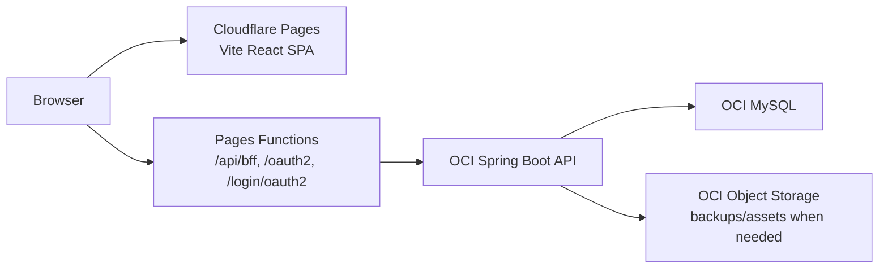

# ReadMates Cloudflare SPA And Google Auth Migration Design

작성일: 2026-04-21
상태: APPROVED DESIGN SPEC

## 결정 요약

ReadMates 프론트엔드는 Vercel/Next.js 서버 의존성을 제거하고 Vite React SPA로 전환한다. 운영 프론트 주소는 Cloudflare Pages 기본 주소인 `https://readmates.pages.dev`를 사용한다. Spring Boot 백엔드는 이미 올라간 OCI 환경을 유지하고, 브라우저는 OCI API를 직접 호출하지 않는다. 대신 Cloudflare Pages Functions가 기존 Next.js BFF 역할을 맡아 `/api/bff/**`, `/oauth2/authorization/**`, `/login/oauth2/code/**` 요청을 OCI Spring Boot로 프록시한다.

PDF 생성은 서버 Playwright route를 제거하고 브라우저 `window.print()` 기반 PDF 저장 흐름으로 바꾼다. Google 로그인은 유일한 운영 로그인 방식이 된다. 기존 Gmail 회원은 최초 Google 로그인 때 verified email로 기존 계정에 자동 연결하고, 신규 Google 사용자는 기본 ReadMates 클럽의 `PENDING_APPROVAL` 멤버십으로 생성한다.

## 목표

- `front`를 Next.js 앱에서 Vite React SPA로 전환한다.
- Cloudflare Pages 무료 플랜에서 `readmates.pages.dev`로 프론트를 배포한다.
- 기존 Next.js BFF route를 Cloudflare Pages Function BFF로 이관한다.
- Spring Boot 백엔드는 OCI에 유지하고 기존 BFF secret 기반 API 보호를 유지한다.
- Google OAuth 로그인만 남기고 email/password 로그인, password reset UI, password invite setup UI를 제거한다.
- 기존 Gmail 기반 회원은 기존 기록을 잃지 않고 Google 계정과 자동 연결한다.
- 신규 Google 사용자는 기본 클럽에 승인대기 상태로 가입한다.
- 승인대기 사용자는 읽기 전용 앱 접근을 허용하되 피드백 리포트와 모든 쓰기 기능은 제한한다.
- 피드백 PDF 저장은 브라우저 print/PDF 흐름으로 처리한다.

## 비범위

- 커스텀 도메인 구매 또는 `readmates.com` 운영 전환
- Cloudflare Workers Paid, R2, D1 도입
- OCI Object Storage를 프론트 정적 호스팅으로 사용하는 구성
- 다중 클럽 선택 가입
- 호스트 권한 위임, 역할 변경, 멤버 강퇴 UI
- 서버에서 one-click PDF binary 생성
- 기존 기록을 다른 Google 계정으로 수동 병합하는 관리자 도구

## 대상 아키텍처



Cloudflare Pages는 정적 SPA 파일과 얇은 프록시 함수만 담당한다. Spring Boot는 인증, 세션 쿠키, 멤버십 권한, 도메인 API의 source of truth다. `READMATES_BFF_SECRET`은 Cloudflare Pages Functions 환경 변수로만 저장하고 브라우저 bundle에는 포함하지 않는다.

## 프론트 전환

`front/app`의 Next App Router route들은 React Router route로 옮긴다. 기존 `features`, `shared/ui`, `shared/api` 타입은 최대한 유지하되 `next/link`, `next/navigation`, `next/headers`, server component data fetching은 제거한다.

라우팅은 다음 구조를 기준으로 한다.

```text
/                         public home
/about                    about
/records                  public records
/sessions/:sessionId      public session detail
/login                    Google login entry
/app                      authenticated app home
/app/pending              approval pending read-only home
/app/session/current      current session read surface
/app/notes                active member notes
/app/archive              archive
/app/me                   account page
/app/sessions/:sessionId  session detail
/app/feedback/:sessionId  feedback document
/app/feedback/:sessionId/print  browser PDF print view
/app/host                 host dashboard
/app/host/members         pending approval management
/app/host/invitations     legacy invitation view if retained during migration
/app/host/sessions/:id/edit host edit
```

## BFF와 OAuth 프록시

Cloudflare Pages Functions는 기존 Next BFF와 동일한 보안 경계를 유지한다.

- `/api/bff/*`는 upstream `/api/**`만 허용한다.
- mutating method는 same-origin `Origin` 또는 `Referer`만 허용한다.
- 브라우저 Cookie와 Content-Type을 upstream으로 전달한다.
- `X-Readmates-Bff-Secret`을 Pages Function에서만 추가한다.
- upstream `Set-Cookie`를 브라우저 응답으로 전달한다.
- `/oauth2/authorization/*`와 `/login/oauth2/code/*`는 Spring OAuth endpoint로 query string과 cookie를 보존해 프록시한다.

## Google 인증 모델

Google 로그인 성공 시 Spring Boot가 `email_verified=true`를 요구한다. 조회 순서는 `google_subject_id`, verified email 순이다.

기존 Gmail 회원은 다음 조건을 만족하면 자동 연결된다.

- Google claim의 `email_verified`가 true다.
- Google email을 lowercase/trim한 값이 기존 `users.email`과 일치한다.
- 해당 user의 `google_subject_id`가 비어 있거나 같은 Google subject다.
- 같은 Google subject가 다른 user에 연결되어 있지 않다.

자동 연결이 성공하면 기존 `users`, `memberships`, `session_participants`, 질문, 리뷰, 피드백 접근 기록은 그대로 유지된다. password hash와 password reset은 운영 로그인에서 사용하지 않는다.

신규 Google 사용자는 기본 클럽 `reading-sai`에 다음 멤버십으로 생성된다.

```text
role = MEMBER
status = PENDING_APPROVAL
joined_at = null
```

## 회원 상태와 권한

내부 상태는 다음 의미로 사용한다.

| 상태 | 의미 | 권한 |
|---|---|---|
| `VISITOR` | 로그인 안 한 공개 방문자 | 공개 페이지만 접근 |
| `PENDING_APPROVAL` | Google 로그인 완료, 호스트 승인 전 | 읽기 전용 앱 접근, 피드백 제한 |
| `ACTIVE MEMBER` | 승인된 일반 회원 | 멤버 기능 |
| `ACTIVE HOST` | 호스트 | 호스트 기능 |

기존 `guest` 표현은 공개 방문자를 뜻하는 `visitor`로 바꾼다. 신규 가입자를 `guest`라고 부르지 않는다.

`PENDING_APPROVAL`은 `/app/pending`, 현재 모임 기본 정보, 공개/클럽 아카이브 읽기 화면을 볼 수 있다. 모든 `POST`, `PUT`, `PATCH`, `DELETE`, `/api/host/**`, 피드백 문서 API는 차단한다.

## 피드백 PDF

Next.js Playwright PDF route는 제거한다. `PDF로 저장` 버튼은 `/app/feedback/:sessionId/print`로 이동하고, print view가 데이터 로딩을 마친 뒤 `window.print()`를 한 번 호출한다.

print CSS 기준:

- navigation, mobile tabbar, action button 숨김
- 흰 배경과 인쇄 친화 텍스트 색상
- A4 여백과 section page-break 규칙
- 제목, 메타, 관찰자 노트, 참여자별 피드백 순서 유지

권한은 피드백 문서 API가 결정한다. `PENDING_APPROVAL`은 `/app/feedback/:sessionId`와 `/print` 모두 제한 화면을 본다.

## 백엔드 변경

- `MembershipStatus.PENDING_APPROVAL`을 추가한다.
- `AuthMeResponse`에 membership status와 approval state를 노출한다.
- `CurrentMember` 또는 새 auth principal 모델이 ACTIVE와 PENDING_APPROVAL을 구분할 수 있게 한다.
- Spring Security에는 `ROLE_PENDING_APPROVAL`을 추가한다.
- Google OAuth login을 `SecurityConfig`에 연결한다.
- OAuth success handler는 ReadMates auth session을 발급하고 `readmates_session` 쿠키를 설정한 뒤 `/app`으로 redirect한다.
- password login, password reset, password invite acceptance API는 운영 UI에서 제거하고 서버 endpoint는 폐기하거나 410 응답으로 고정한다.
- 호스트가 가입 승인 대기자를 조회하고 승인/거절할 수 있는 API를 추가한다.

## 데이터 마이그레이션

MySQL migration은 다음을 수행한다.

- `memberships.status` check constraint에 `PENDING_APPROVAL`을 추가한다.
- 기존 password 기반 seeded/운영 사용자를 Google-only 계정으로 전환한다.
- Gmail 주소가 있는 기존 사용자는 `auth_provider='GOOGLE'`, `password_hash=null`, `password_set_at=null`로 전환한다.
- `google_subject_id`는 최초 Google 로그인 때 채운다.

## 테스트 기준

- backend integration test: 기존 Gmail 회원 자동 연결, 신규 승인대기 생성, subject 충돌 거부, email unverified 거부
- backend security test: pending user는 읽기 전용 API만 접근, 피드백/쓰기/host API 접근 거부
- backend host test: 승인 대기 목록, 승인, 거절
- frontend unit test: login card는 Google 버튼만 표시, pending shell은 쓰기 CTA를 숨김, feedback print route 권한 처리
- frontend function test: Cloudflare BFF path validation, secret header, set-cookie propagation, OAuth proxy redirect/cookie propagation
- e2e smoke: Google login은 mock 또는 test-only fixture로 세션을 만들고 member/host/pending 흐름을 검증

## 배포 기준

Cloudflare Pages 설정:

```text
Build command: pnpm build
Build output directory: dist
Environment:
  READMATES_API_BASE_URL=https://<oci-backend-origin>
  READMATES_BFF_SECRET=<server secret>
```

Google Cloud Console redirect URI:

```text
https://readmates.pages.dev/login/oauth2/code/google
```

Spring Boot 운영 환경:

```text
readmates.app-base-url=https://readmates.pages.dev
readmates.allowed-origins=https://readmates.pages.dev
readmates.bff-secret=<same secret as Cloudflare Pages>
spring.security.oauth2.client.registration.google.client-id=<client id>
spring.security.oauth2.client.registration.google.client-secret=<client secret>
spring.security.oauth2.client.registration.google.scope=openid,email,profile
```
