# ReadMates Spring AI 2.0 전환과 분산 추적 설계

작성일: 2026-07-16

상태: APPROVED DESIGN

대상: Spring Boot API의 AI 세션 기록 생성·부분 재생성, AI Kafka worker, 관측 인프라

## 1. 결정 요약

ReadMates의 OpenAI, Anthropic, Google GenAI 직접 SDK 호출을 Spring AI 2.0으로 교체한다. 현재 AI 기능은 사용 중이 아니므로 legacy pipeline이나 직접 SDK fallback을 남기지 않고 grounded whole-transcript 경로 하나로 정리한다.

선택한 구조는 **thin adapter**다. Spring AI는 provider 호출과 응답 변환 경계에서만 사용하고, 다음 정책은 계속 ReadMates application 계층이 소유한다.

- 입력 예산과 모델 capability 검증
- 호출 admission, 횟수 상한, 비용 예약·정산
- fallback, schema correction, section repair 결정
- grounding 검증과 evidence 생성
- Redis job 상태와 Kafka 재전달 복구
- audit, metric, commit recovery, kill switch

Spring AI의 자동 retry나 schema validation advisor가 이 정책을 우회해서는 안 된다. 한 번의 application 호출 예약은 정확히 한 번의 물리 HTTP 요청만 만들며, job 하나가 수행할 수 있는 물리 provider 요청은 최대 3회다.

Micrometer Tracing, OpenTelemetry OTLP, Grafana Tempo도 함께 도입한다. 정상 trace는 API → Kafka producer → Kafka consumer/worker → Spring AI → provider 흐름을 연결하지만 prompt, completion, transcript, evidence, 사용자 식별정보는 log, metric, span, baggage 어디에도 저장하지 않는다.

## 2. 배경과 현재 구조

현재 구현은 다음 직접 SDK dependency를 가진다.

- `com.openai:openai-java:4.32.0`
- `com.anthropic:anthropic-java:2.27.0`
- `com.google.genai:google-genai:1.53.0`

grounded 생성 경로는 provider마다 다음 계층을 반복한다.

```text
DefaultGroundedGenerationExecutor
  -> WholeTranscriptGroundedGenerator
    -> OpenAi|Claude|GeminiWholeTranscriptGroundedGenerator
      -> OpenAi|Claude|GeminiApiPort
        -> OpenAi|Claude|GeminiApiClient
          -> provider SDK
```

동시에 사용하지 않는 legacy 경로가 남아 있다.

- provider별 `ContentGenerator` 3개
- provider별 `ContentRegenerator` 3개
- legacy outbound port
- `AiGenerationPipelineMode`
- worker, Redis codec, DTO, configuration의 `pipelineMode` 분기

보존해야 하는 현재 안전장치는 다음과 같다.

- `AiGenerationOrchestrator`의 preflight와 admission
- metadata-only Kafka message
- Redis의 transcript, validated turn, job, result, evidence 저장과 6시간 TTL
- Redis의 원자적 `llmCallCount` 상한
- `GroundedInputBudgetGuard`, versioned schema, renderer, codec
- `GroundedGenerationValidator`와 1회 section repair
- provider fallback과 cost accounting
- audit log, PII scanner, commit recovery
- 기본 비활성화 kill switch와 provider allowlist

현재 OpenAI와 Anthropic SDK retry는 명시적으로 0이지만, Spring AI 기본값을 그대로 사용하면 application의 호출 상한과 일치하지 않는다. Spring AI OpenAI retry의 기본 max attempts, Anthropic SDK retry, `validateSchema()` advisor의 별도 retry 가능성을 모두 명시적으로 제거해야 한다.

현재 observability stack은 Prometheus와 Grafana를 제공하지만 trace backend가 없다. `RequestIdFilter`가 `X-Readmates-Request-Id`와 MDC `requestId`를 관리하고 JSON logging을 사용한다. 이 request ID는 유지하되 W3C trace context를 대체하는 값으로 사용하지 않는다.

## 3. 목표

- 세 provider 호출을 Spring AI 2.0의 `ChatModel`과 `ChatClient`로 통일한다.
- provider별 중복 client/port/generator와 legacy pipeline을 제거한다.
- 기존 grounded domain port와 application workflow를 보존한다.
- automatic retry가 없는 물리 호출 계약을 provider별 mock HTTP test로 증명한다.
- fallback, schema correction, repair를 하나의 최대 3회 state machine으로 통제한다.
- 호출 전에 비용을 예약하고 실제 usage 또는 결과 불명 추정 비용으로 정산한다.
- API부터 provider까지 trace를 연결하고 Grafana에서 metric exemplar를 통해 Tempo trace로 이동할 수 있게 한다.
- provider, Tempo, OTLP exporter, Kafka 재전달, Redis 장애를 각각 격리하고 failure mode를 검증한다.
- 구현 후 현재 구조와 새 구조를 코드·설정·운영·검증 수준에서 비교하는 별도 living document를 제공한다.

## 4. 비목표

- frontend route, 사용자 API contract, 생성 결과 JSON contract를 재설계하지 않는다.
- prompt 내용, completion 내용, transcript, evidence를 수집하는 observability 기능을 만들지 않는다.
- streaming 응답, tool calling, web search, thinking 옵션을 도입하지 않는다.
- 벡터 저장소, RAG, 대화 memory를 새로 도입하지 않는다.
- provider별 raw SDK fallback이나 legacy pipeline fallback을 남기지 않는다.
- 이 설계 단계에서는 production 배포, secret 변경, live provider 호출을 수행하지 않는다.
- Tempo를 인터넷에 직접 노출하거나 Tempo 자체를 인증 경계로 사용하지 않는다.

## 5. 선택한 아키텍처

### 5.1 전체 흐름

```mermaid
flowchart LR
    API["Spring MVC API"] --> ORCH["AiGenerationOrchestrator"]
    ORCH --> REDIS["Redis job and admission"]
    ORCH --> KP["Kafka producer"]
    KP --> KC["Kafka consumer"]
    KC --> WORKER["AiGenerationWorker"]
    WORKER --> EXEC["GroundedGenerationExecutor"]
    EXEC --> GATE["ProviderCallGate"]
    GATE --> RESERVE["Atomic call and cost reservation"]
    RESERVE --> ADAPTER["SpringAiWholeTranscriptGroundedGenerator"]
    ADAPTER --> CLIENTS["Map Provider to ChatClient"]
    CLIENTS --> PROVIDER["OpenAI, Anthropic, Google GenAI"]
    EXEC --> VALIDATE["Grounding validator and repair"]
    VALIDATE --> RESULT["Redis result and audit"]
    API -. "W3C trace context" .-> KP
    KP -. "Kafka observation" .-> KC
    CLIENTS -. "Micrometer observations" .-> OTLP["OTLP batch exporter"]
    OTLP -.-> TEMPO["Grafana Tempo"]
    TEMPO -.-> GRAFANA["Grafana"]
```



Spring AI는 outbound adapter 내부에만 들어간다. application service는 Spring AI 타입을 알지 않고 기존 `WholeTranscriptGroundedGenerator`와 domain output/error를 사용한다.

### 5.2 bean 구성

- `AiGenerationSpringAiConfig`는 `readmates.aigen.enabled=true`일 때만 로드한다.
- Spring AI의 단일 기본 chat model 자동 선택은 사용하지 않는다. 세 provider model을 명시적으로 만들고 `Map<Provider, ChatClient>`로 조립한다.
- 각 `ChatClient`는 `ChatClientBuilderConfigurer`를 거쳐 공통 observation/customizer를 잃지 않게 한다.
- provider bean은 enabled-provider allowlist, API key, model capability가 함께 유효할 때만 생성한다.
- AI가 비활성화된 기본 환경에서는 provider key가 없어도 application context가 정상 기동해야 한다.
- 동일 provider의 model 차이는 매 요청의 allowlisted `ModelId`와 provider options에서 선택한다. 임의 model 문자열을 provider로 전달하지 않는다.

Spring AI starter의 기본 auto-configuration이 단일 provider를 선택하거나 key 누락으로 부팅을 실패시키지 않도록 chat model 자동 선택을 비활성화하고 ReadMates configuration이 model lifecycle을 소유한다. 이 조건은 no-key context test로 고정한다.

### 5.3 코드 경계

| 현재 | 처리 | 목표 구조 |
|---|---|---|
| `WholeTranscriptGroundedGenerator` | 유지 | application/outbound 경계 |
| provider별 grounded generator 3개 | 통합 | `SpringAiWholeTranscriptGroundedGenerator` 구현 하나를 provider별 bean으로 구성 |
| provider별 `ApiPort` 3개 | 삭제 | Spring AI `ChatModel` 경계 사용 |
| provider별 `ApiClient` 3개 | 삭제 | Spring AI provider module 사용 |
| 직접 provider SDK dependency 3개 | 삭제 | Spring AI BOM과 provider modules |
| `DefaultGroundedRequestRenderer` | 유지 | prompt와 schema의 단일 source of truth |
| `GroundedGenerationSchemaResource` | 유지 | custom converter가 같은 versioned schema 사용 |
| `GroundedDraftJsonCodec` | 유지 | Spring AI 응답을 domain draft로 변환 |
| `GeminiSchemaCompatAdapter` | 축소 유지 | Google이 지원하는 schema subset 변환에만 사용 |
| `LlmErrorMapper` | 교체 | `SpringAiErrorMapper`가 provider-neutral safe error를 생성 |
| legacy generator/regenerator와 ports | 삭제 | grounded primary와 section repair만 지원 |
| `AiGenerationPipelineMode`와 분기 | 삭제 | grounded-only, audit `pipelineVersion`은 유지 |
| `ProviderFallbackChain` | 단순화 | model catalog와 grounded provider eligibility만 판단 |
| SDK retry 상수 test | 교체·강화 | provider별 mock server의 실제 request count test |

## 6. dependency와 configuration

### 6.1 dependency 원칙

- Spring AI BOM `org.springframework.ai:spring-ai-bom:2.0.0`이 Spring AI module 버전의 source of truth다.
- OpenAI, Anthropic, Google GenAI chat model module을 BOM 아래에서 사용한다.
- 직접 provider SDK dependency 선언은 모두 제거한다.
- Micrometer Tracing의 OpenTelemetry bridge와 OTLP exporter는 Spring Boot 4의 관리 버전을 우선한다.
- Spring AI 또는 tracing을 위해 Jackson/Kotlin/coroutines/netty 버전을 개별 강제하지 않는다.
- `dependencyInsight`로 Jackson 2/3, OkHttp, Netty, OpenTelemetry 충돌과 중복 provider SDK 유입을 확인한다.

Spring AI 2.0.0은 2026-06-12 GA 공지를 기준으로 선택했다. 구현 시 다음 공식 문서를 source로 사용한다.

- [Spring AI 2.0.0 GA](https://spring.io/blog/2026/06/12/spring-ai-2-0-0-GA-available-now/)
- [Spring AI ChatClient](https://docs.spring.io/spring-ai/reference/api/chatclient.html)
- [Spring AI observability](https://docs.spring.io/spring-ai/reference/observability/index.html)
- [Spring Kafka Micrometer observation](https://docs.spring.io/spring-kafka/reference/kafka/micrometer.html)
- [Spring Boot tracing](https://docs.spring.io/spring-boot/reference/actuator/tracing.html)

### 6.2 공통 안전 기본값

- Spring AI retry max attempts: `1`
- provider SDK 내부 retry: `0`
- `validateSchema()` advisor: 사용 금지
- streaming: 비활성화
- tool calling, search, thinking: 비활성화
- prompt/completion/input/output/tool content observation: 모두 명시적으로 `false`
- 요청 read timeout: 기존 상한인 4분 유지
- provider별 동시 호출: 인스턴스당 기본 2, 설정 가능, 대기 없이 fail-fast
- job의 provider 물리 호출 상한: 3
- admission lease: 기존 5분 유지, 매 물리 호출 직전에 갱신
- Redis payload TTL: 기존 6시간 유지

4분 attempt가 최대 3회 수행될 수 있으므로 Kafka consumer의 `max.poll.interval.ms`와 worker 처리 정책은 최악 실행시간보다 커야 한다. 구현에서는 명시적 consumer 설정과 contract test를 추가하고, 긴 호출 중 불필요한 group rebalance가 발생하지 않게 한다. 이 값은 provider timeout, backoff 상한, repair 상한을 합친 계산식으로 문서화하며 숨은 client 기본값에 맡기지 않는다.

### 6.3 provider별 옵션

#### OpenAI

- `store=false`
- strict JSON schema response format
- allowlisted model과 maximum completion tokens
- SDK retry 0
- usage를 input, cached input, output token으로 domain `TokenUsage`에 매핑

#### Anthropic

- native structured output을 지원한다고 검증된 model allowlist만 grounded-capable로 등록
- versioned system prompt의 prompt caching 사용
- max retries 0
- cache creation, cache read, non-cached input을 provider metadata에서 각각 추출
- cache breakdown을 Spring AI 응답에서 안정적으로 추출하는 contract test를 통과하지 못하면 prompt caching을 켜지 않음

#### Google GenAI

- JSON response MIME type과 response schema 사용
- `GeminiSchemaCompatAdapter`로 지원 schema subset만 변환
- tools, search grounding, thinking 비활성화
- paid-tier retention 설정을 config validator가 검증
- 지원되는 경우 no-retention header를 best-effort로 적용하되 이것만을 privacy 보장으로 표현하지 않음

provider별 retention과 structured-output 지원 범위는 변경 가능성이 있으므로 active 비교 문서에서 공식 provider 문서 확인일과 model allowlist를 함께 기록한다.

## 7. 한 번의 물리 호출 계약

### 7.1 단계 순서

provider 호출은 항상 다음 순서를 따른다.

1. deterministic renderer가 versioned system/user prompt, versioned JSON schema, input budget 결과를 만든다.
2. `ProviderCallGate`가 provider circuit과 bounded-concurrency permit을 획득한다.
3. admission lease를 갱신한다.
4. 물리 호출 횟수와 최대 예상 비용을 Redis에서 하나의 원자적 operation으로 예약하고 attempt를 `IN_FLIGHT`로 기록한다.
5. provider options strategy가 model별 옵션을 만든다.
6. `ChatClient.responseEntity(custom converter)`에 해당하는 non-streaming 호출을 정확히 한 번 수행한다.
7. converter가 동일한 versioned schema와 `GroundedDraftJsonCodec`으로 응답을 변환한다.
8. usage, 비용, safe error, audit, metric, trace, Redis attempt 상태를 정산한다.
9. application validator가 grounding을 검증하고 필요하면 허용된 다음 물리 호출을 결정한다.

circuit-open 또는 concurrency permit 거절은 물리 요청이 아니므로 `llmCallCount`와 비용을 소비하지 않는다. fallback 여부는 application retry policy가 판단한다.

### 7.2 물리 attempt ledger

provider가 idempotency를 보장하지 않는 이상 worker crash를 포함한 exactly-once 과금은 보장할 수 없다. 이를 숨기지 않고 bounded at-least-once로 관리한다.

Redis의 provider attempt metadata는 다음만 저장한다.

- random attempt ID와 1부터 시작하는 ordinal
- job ID, provider, allowlisted model
- call mode: `PRIMARY`, `FALLBACK`, `SCHEMA_CORRECTION`, `SECTION_REPAIR`
- 상태: `IN_FLIGHT`, `SUCCEEDED`, `FAILED`, `UNKNOWN`
- 최대 예상 비용과 정산 basis
- 시작·종료 시각과 safe error code

prompt, completion, schema 본문, transcript, evidence는 저장하지 않는다. attempt metadata TTL은 job과 같은 6시간이며, 월 비용 counter의 실제 또는 unknown 추정 비용은 해당 월의 counter lifecycle을 따른다.

`ProviderCallReservationPort`의 Redis adapter는 job 상태 확인, 3회 상한, admission ownership, 월 비용 상한, `llmCallCount` 증가, 예상 비용 예약, `IN_FLIGHT` attempt 기록을 하나의 Lua operation으로 처리한다. 별도의 check-then-act 호출로 분리하지 않는다.

worker가 재전달되었을 때 미해결 `IN_FLIGHT` attempt를 발견하면 다음과 같이 처리한다.

- 이전 요청을 다시 같은 attempt로 보내지 않는다.
- 이전 attempt를 `UNKNOWN`으로 바꾸고 예상 비용을 유지한다.
- 이미 소비한 물리 호출 slot으로 간주한다.
- 남은 slot과 retry policy가 허용할 때만 새 attempt ID로 진행한다.
- slot이 없으면 안전한 실패 상태와 audit를 남긴다.

이 정책은 중복 과금 가능성을 없애지는 못하지만 최대 3회 밖으로 확산되는 것을 막는다.

### 7.3 비용 예약과 정산

현재 월 비용은 성공 usage를 받은 뒤 증가하므로 timeout 뒤 provider가 과금했지만 usage를 받지 못한 경우 예산을 우회할 수 있다. 새 정책은 호출 전에 비용을 예약한다.

최대 예상 비용은 다음 값으로 계산한다.

- renderer/budget guard가 계산한 입력 token 수
- cached input 할인은 적용하지 않은 full input price
- cache write가 가능한 provider는 일반 input과 cache-write 요율 중 더 높은 입력 요율
- 실제 요청에 설정한 maximum output tokens
- allowlisted model의 versioned pricing

현재 `TokenUsage`의 input/cached-input/output 3개 channel은 Anthropic cache creation의 별도 요율을 정확히 표현하지 못한다. 구현은 domain usage와 pricing을 다음 4개 channel로 확장한다.

- non-cached input tokens / input price
- cache-write input tokens / cache-write price
- cache-read input tokens / cached-input price
- output tokens / output price

기존 API 응답의 token summary는 하위호환을 위해 input, cached input, output 형태를 그대로 유지한다. API의 input 값은 non-cached input과 cache-write input의 합이고 cached input은 cache-read 값이다. 비용 계산·Redis 정산·audit에서는 cache-write channel을 합치지 않는다. Spring AI의 generic usage가 provider별 breakdown을 제공하지 않으면 adapter가 provider response metadata에서 추출한다. caching을 사용했는데 breakdown이 불완전하면 실제 usage로 할인 정산하지 않고 예약한 최대 예상 비용을 `ESTIMATED_UNKNOWN`으로 유지한다.

정산 basis는 다음과 같다.

| 결과 | 비용 처리 | basis |
|---|---|---|
| 4개 channel이 완전한 usage를 포함한 성공 | 예약을 실제 usage 비용으로 원자적 교체 | `ACTUAL` |
| 4개 channel이 완전한 usage를 포함한 provider 실패 | 확인된 usage로 원자적 교체 | `ACTUAL` |
| caching 사용 중 usage breakdown 불완전 | 할인 추정 없이 최대 예상 비용 유지 | `ESTIMATED_UNKNOWN` |
| timeout, connection reset, worker crash 등 요청 수락 여부 불명 | 예상 비용 유지 | `ESTIMATED_UNKNOWN` |
| gate reject, lease 실패, Redis reservation 거절 | 애초에 비용·호출을 예약하지 않음 | `NONE` |
| transport 진입 전 실패임을 계측으로 확정 | 예약 해제 | `NONE` |

초기 정책은 provider가 미과금이라고 명시적으로 증명되지 않은 outbound 실패를 모두 `ESTIMATED_UNKNOWN`으로 처리한다. 과대 계산은 운영자가 audit 근거로 조정할 수 있지만 자동으로 추정 비용을 해제하지 않는다. attempt ID를 idempotency key로 사용해 재전달 정산이 비용을 중복 증감하지 않게 한다.

## 8. retry, fallback, correction, repair

### 8.1 application만 retry를 소유한다

Spring AI retry, provider SDK retry, schema validation advisor retry는 모두 비활성화한다. retry라는 용어는 application이 새 physical attempt를 예약하는 경우만 뜻한다.

### 8.2 최대 3회 state machine

```text
slot 1: PRIMARY
  success + valid grounding       -> finish
  success + repairable grounding  -> SECTION_REPAIR (slot 2)
  schema/parse failure            -> SCHEMA_CORRECTION (slot 2)
  transient/429                   -> FALLBACK or capped same-provider retry (slot 2)

slot 2 result:
  valid                           -> finish
  parsed + repairable grounding   -> SECTION_REPAIR (slot 3)
  other failure                   -> fail

slot 3 result:
  valid                           -> finish
  any failure                     -> fail
```

- schema correction은 최대 1회다.
- section repair는 최대 1회다.
- fallback 뒤 또 다른 fallback을 연쇄하지 않는다.
- schema correction 또는 repair가 실패하면 다른 retry branch를 새로 열지 않는다.
- 모든 branch는 동일한 attempt ledger, lease, cost reservation, audit, metric을 사용한다.

### 8.3 오류별 결정

| 오류 | 결정 | circuit에 반영 |
|---|---|---|
| connect/read timeout, connection error, HTTP 5xx | jitter backoff 뒤 eligible fallback | 실패로 반영 |
| HTTP 429 | capped `Retry-After`를 존중해 fallback 또는 같은 provider 1회 | circuit failure rate에는 미반영, rate metric 별도 |
| JSON/schema/parse failure | 강화된 schema instruction으로 같은 provider 1회 correction | 미반영 |
| parsed output의 grounding 위반 | 해당 section 1회 repair | 미반영 |
| auth, permission | 즉시 실패·운영 alert | 미반영 |
| provider safety refusal | 즉시 안전 실패 | 미반영 |
| invalid request, context limit | 즉시 실패 | 미반영 |
| circuit open, concurrency reject | 호출 예약 없이 eligible fallback | 물리 실패로 중복 기록하지 않음 |

`SpringAiErrorMapper`는 Spring AI의 transient/non-transient exception, HTTP status, provider response category를 기존 `ErrorCode`와 고정된 public-safe message로 바꾼다. raw exception message나 response body를 audit 또는 log로 전달하지 않는다.

## 9. structured output 계약

- `GroundedGenerationSchemaResource`가 schema의 유일한 source of truth다.
- Spring AI가 Kotlin type에서 별도 schema를 생성하게 두지 않는다.
- custom `StructuredOutputConverter`는 versioned schema를 provider response format에 전달하고 `GroundedDraftJsonCodec`으로 domain model을 만든다.
- `validateSchema()` advisor는 사용하지 않는다. schema correction 여부는 application state machine이 결정한다.
- provider가 native structured output을 지원하지 않는 model은 capability allowlist에서 제외한다.
- Gemini 호환 변환은 의미를 약화하지 않는 지원 subset 변환만 허용한다. 필수 제약을 표현할 수 없으면 해당 model을 비활성화한다.

## 10. 분산 추적 설계

### 10.1 trace 전파

- Spring MVC server observation이 API span을 만든다.
- AI 전용 `KafkaTemplate`과 listener container 모두 observation을 명시적으로 활성화한다.
- Kafka W3C trace context header가 producer와 consumer span을 연결한다.
- worker는 job stage와 physical attempt마다 내부 span을 만든다.
- Spring AI chat model observation이 provider call span을 만든다.
- OTLP batch exporter가 trace를 Tempo로 비동기 전송한다.
- Kafka redelivery는 새 consumer/worker span을 만들되 원래 producer context와 연결되고, `attempt`와 redelivery outcome으로 구분한다.

기존 `requestId`는 지원·로그 검색용 correlation ID로 유지한다. JSON log에는 활성 context가 있을 때 `traceId`와 `spanId`를 추가한다. `requestId`, `traceId`, `jobId`는 서로 다른 목적이며 하나를 다른 값으로 덮어쓰지 않는다.

### 10.2 span attribute allowlist

허용한다.

- provider
- allowlisted model alias
- job kind
- stage/call mode
- attempt ordinal
- outcome
- safe error code
- internal random job ID

금지한다.

- transcript, prompt, completion, schema 본문
- generated record, evidence, book/member/session/club 이름
- raw exception message나 provider response body
- host user ID, session ID, club ID
- token, credential, provider request header

job ID는 내부 random correlation 값으로만 span/MDC에 넣고 provider baggage로 전송하지 않는다. W3C baggage는 사용하지 않는다.

### 10.3 sampling, retention, exemplar

- 초기 trace sampling은 invite-only 저트래픽을 전제로 100%다.
- Tempo block retention은 7일이다.
- sampling과 retention은 span volume, exporter drop, disk 사용량을 측정한 뒤 변경한다.
- metric label에 trace ID나 job ID를 넣지 않는다.
- provider latency histogram exemplar가 Grafana의 Tempo datasource로 연결되게 Prometheus exemplar storage와 datasource mapping을 설정한다.

### 10.4 exporter 장애 격리

- OTLP는 batch export와 bounded queue를 사용한다.
- Tempo down, DNS 실패, exporter queue full, span drop은 product request를 실패시키지 않는다.
- exporter failure와 dropped span은 metric과 alert로만 노출한다.
- shutdown flush는 bounded timeout을 사용해 application 종료를 무기한 막지 않는다.

## 11. log, metric, audit

### 11.1 log

구조화 log의 AI allowlist는 다음이다.

- request ID, trace ID, span ID, job ID
- provider, model alias, stage, attempt ordinal
- outcome, safe error code, latency

prompt/completion logging advisor와 request/response body logger는 production code에서 사용하지 않는다. 테스트가 content redaction을 검증할 때는 synthetic fixture만 사용할 수 있다.

### 11.2 metric

기존 AI metric을 보존하고 다음 관측을 보강한다.

- provider physical call count와 latency
- call mode와 outcome
- application retry/fallback/correction/repair 결과
- circuit state와 concurrency rejection
- actual cost와 estimated-unknown cost
- OTLP export success/failure/drop
- Tempo readiness, ingestion, block storage 사용량

label은 provider, allowlisted model, mode, outcome, bounded error code로 제한한다. job ID, trace ID, session/club/user ID는 metric label로 금지한다.

### 11.3 audit와 migration

새 Flyway migration은 `ai_generation_audit_log`에 additive nullable/defaulted column을 추가한다.

- `trace_id`: nullable W3C trace ID
- `provider_attempt`: nullable attempt ordinal
- `provider_call_mode`: nullable call mode
- `cost_basis`: `NONE`, `ACTUAL`, `ESTIMATED_UNKNOWN`; historical row는 `NONE`
- `cache_write_input_tokens`: cache creation 비용을 일반 input과 분리, historical row는 `0`

`pipeline_version`은 grounded schema와 renderer 버전을 설명하는 audit field로 유지한다. runtime 선택을 위한 `pipelineMode`와는 별개다. migration은 이전 서버 image가 알지 못하는 column을 추가할 뿐 기존 column을 삭제하거나 변경하지 않는다.

audit error message는 `SpringAiErrorMapper`가 만든 고정된 safe message만 저장한다. provider raw message는 512자 절단 전에 이미 폐기되어야 한다.

## 12. Tempo와 Grafana 배치

### 12.1 local

- `ops/observability/local/compose.yml`에 single-binary Tempo와 persistent volume을 추가한다.
- OTLP endpoint가 host 개발 서버에 필요할 때는 loopback에만 bind한다.
- Grafana는 내부 Tempo datasource로 query한다.
- Prometheus가 Tempo metrics와 readiness를 수집한다.

### 12.2 OCI

- `deploy/oci/compose.infra.yml`에 Tempo를 추가한다.
- Tempo query와 OTLP port를 public host에 publish하지 않는다.
- API, Grafana, Prometheus와 필요한 내부 network만 공유한다.
- persistent volume과 7일 retention을 명시한다.
- Tempo는 자체 인증을 제공하는 경계로 보지 않는다. 외부 접근은 기존 운영 접근 경계와 Grafana를 통해서만 허용한다.

### 12.3 dashboard와 alert

- AI dashboard에 provider latency/call outcome/cost basis/circuit/exporter health를 추가한다.
- Grafana datasource provisioning에 Tempo와 Prometheus exemplar-to-trace mapping을 추가한다.
- Tempo down, exporter drop 증가, unknown estimated cost 증가, circuit open 지속, physical call cap 소진을 alert 대상으로 둔다.

Tempo local deployment와 인증 제약은 [Grafana Tempo local deployment 문서](https://grafana.com/docs/tempo/latest/set-up-for-tracing/setup-tempo/deploy/locally/)를 기준으로 한다.

## 13. 보안과 privacy

- 실제 prompt와 completion은 모든 환경에서 log/trace/audit 저장 금지다.
- 테스트는 synthetic fixture만 content assertion에 사용할 수 있다.
- `scripts/aigen-pii-check.sh`를 Spring AI logging advisor, observation content flag, baggage, raw exception logging까지 검사하도록 확장한다.
- Kafka payload는 계속 job ID 중심 metadata-only다. trace context header 추가가 domain payload 확장을 의미하지 않는다.
- provider key는 기존 secret injection 경계를 사용하고 Spring AI property dump, actuator env, error log로 노출하지 않는다.
- `/actuator/prometheus`는 기존 보안 경계를 유지한다.
- Tempo는 public port를 갖지 않는다.
- public release scanner와 image dependency scan이 새 starter와 transitive dependency를 검사한다.
- provider privacy/retention은 application의 no-log 정책과 별개다. provider별 공식 계약과 계정 tier를 운영자가 확인해야 한다.

## 14. legacy 제거와 호환성

`AiGenerationPipelineMode`와 legacy generator/regenerator는 한 번에 제거한다. feature가 사용 중이지 않고 기본 kill switch가 꺼져 있으므로 runtime dual-write나 legacy fallback은 만들지 않는다.

Redis codec은 rolling transition 동안 과거 payload의 알 수 없는 `pipelineMode` field를 무시할 수 있어야 하지만 그 값으로 실행 경로를 선택하지 않는다. 새 payload는 `pipelineMode`를 쓰지 않는다.

rollback할 때는 다음 순서를 지킨다.

1. AI kill switch와 Kafka consumer를 먼저 비활성화한다.
2. 새 grounded-only Redis job이 남아 있는 동안 이전 image가 이를 소비하지 않게 한다.
3. job TTL 6시간 만료를 기다리거나 AI namespace만 대상으로 한 승인된 scoped cleanup을 수행한다.
4. 이전 서버 image로 rollback한다.

전체 Redis flush나 다른 기능 key 삭제는 rollback 절차에 포함하지 않는다. additive audit migration과 Tempo는 서버 rollback 뒤에도 남겨도 된다.

## 15. 배포 순서

1. Tempo, volume, Grafana datasource, Prometheus scrape/alert를 먼저 배포하고 readiness를 확인한다.
2. additive audit migration과 새 서버 image를 AI kill switch가 꺼진 상태로 배포한다.
3. no-key context, OTLP exporter 장애 격리, Kafka observation을 확인한다.
4. 명시적으로 key와 비용을 허용한 환경에서 provider별 최소 synthetic live smoke를 1회 수행한다.
5. schema, usage, cost reconciliation, trace 연결, content 비노출을 확인한다.
6. enabled-provider allowlist를 활성화한다.
7. provider error/rate/latency, unknown estimated cost, exporter drop, Tempo disk를 관찰한다.

실제 production 배포와 live provider smoke는 별도 사용자 요청과 운영 권한이 있어야 수행한다.

## 16. 검증 전략

### 16.1 unit와 architecture

- provider options strategy별 option/redaction test
- provider별 non-cached/cache-write/cache-read/output usage mapping과 비용 계산 test
- custom converter와 versioned schema/codec test
- `SpringAiErrorMapper`의 status/exception/safe-message table test
- retry state machine과 최대 3회 property test
- trace attribute allowlist와 metric cardinality test
- legacy class/dependency/`pipelineMode` 부재 architecture test
- AI disabled/no key application context test
- 세 provider `ChatClient` map wiring test

### 16.2 physical-call contract

provider별 mock HTTP server가 실제 request count를 센다.

- application reservation 1회가 HTTP request 1회인지 확인
- Spring AI와 provider SDK가 429/5xx/timeout에 숨은 retry를 하지 않는지 확인
- schema conversion failure가 advisor retry를 만들지 않는지 확인
- circuit-open/concurrency reject가 HTTP request와 call counter를 만들지 않는지 확인
- primary/fallback/correction/repair 전체가 3회를 넘지 않는지 확인

### 16.3 Redis, Kafka, crash recovery

- call count와 cost reservation의 단일 Lua 원자성
- concurrent reservation에서 cap 초과 방지
- actual reconciliation과 unknown estimate의 idempotency
- cache-write premium과 불완전 usage가 월 비용 cap을 과소 계산하지 않는지 확인
- `IN_FLIGHT` worker crash 뒤 redelivery가 attempt를 재사용하지 않는지 확인
- metadata-only Kafka payload와 W3C trace header 분리
- producer/consumer observation 활성화와 manual ack/redelivery 연결
- Redis 장애 시 provider 호출 전 fail-closed
- Kafka `max.poll.interval.ms`가 계산된 최악 job 실행시간을 수용하는지 확인

### 16.4 failure injection

- Tempo down
- OTLP endpoint timeout과 exporter queue full
- provider 429, 5xx, auth/permission, safety refusal, malformed JSON, slow response
- provider 응답 뒤 worker crash
- Redis lease 만료와 reservation 실패
- Kafka redelivery

Tempo/exporter failure는 AI 결과를 바꾸지 않아야 한다. Redis ownership/counter failure는 provider 호출을 막아야 한다.

### 16.5 실행 gate

구현 완료 전에 최소 다음 명령을 실행한다.

```bash
./scripts/server-ci-check.sh
./server/gradlew -p server integrationTest
pnpm --dir front test:e2e
bash scripts/aigen-pii-check.sh
./scripts/validate-prometheus-rules.sh
./scripts/validate-prometheus-config.sh
./scripts/validate-tempo-config.sh
./scripts/lint-grafana-dashboards.sh
./scripts/observability-local-smoke.sh
./scripts/build-public-release-candidate.sh
./scripts/public-release-check.sh .tmp/public-release-candidate
```

`validate-tempo-config.sh`는 새로 추가한다. observability smoke는 OTLP trace를 전송하고 Tempo API에서 같은 synthetic trace를 조회하며 Grafana datasource provisioning도 확인하도록 확장한다.

live provider contract는 API key와 비용이 필요한 별도 opt-in gate다. 실행하지 못하면 provider별로 정확한 미실행 사유를 release evidence에 기록한다. 일반 CI는 mock HTTP contract로 숨은 retry와 schema/usage mapping을 검증한다.

dependency 검증에는 Gradle dependency report/`dependencyInsight`, server image build, Trivy, public release candidate scan을 포함한다.

## 17. 문서 산출물

구현과 별개로 다음 living document를 만든다.

`docs/development/spring-ai-2-provider-architecture.md`

이 문서는 구현 후 승인 목표가 아니라 실제 코드와 검증 결과를 기준으로 다음을 비교한다.

- Before/After sequence diagram
- 기존 class/package와 신규·삭제·유지 class/package의 일대일 map
- dependency와 auto-configuration 차이
- provider별 options, structured output, usage, retention 차이
- 물리 호출, retry, fallback, correction, repair 차이
- Redis call/cost reservation과 crash recovery
- log, metric, audit, trace, sampling, retention
- Tempo/Grafana/Prometheus 배치
- migration, configuration, environment variable 변화
- 삭제·추가·수정 파일 inventory
- 실제 실행한 test/smoke evidence와 미실행 항목
- residual risk와 rollback 절차

구현 중 함께 갱신할 active 문서는 다음이다.

- `docs/development/architecture.md`
- `docs/development/session-import-generator.md`
- `docs/operations/runbooks/ai-session-generation.md`
- `docs/operations/observability/README.md`
- `docs/operations/observability/operator-guide.md`
- `docs/operations/observability/metrics-catalog.md`
- `docs/operations/observability/dashboards.md`
- `docs/operations/observability/alerts.md`
- `scripts/README.md`
- `CHANGELOG.md`의 Unreleased

과거 `docs/superpowers` 기록은 이 새 설계 문서 외에는 다시 쓰지 않는다.

## 18. 완료 조건

- 직접 provider SDK dependency, client, port, provider별 중복 generator가 없다.
- legacy generator/regenerator와 `AiGenerationPipelineMode` runtime branch가 없다.
- grounded renderer/schema/codec/validator/evidence/commit recovery가 보존된다.
- 세 provider가 Spring AI `ChatClient` map으로 호출된다.
- 모든 자동 retry가 꺼져 있고 mock server가 예약 1회당 물리 HTTP 1회를 증명한다.
- job당 provider 호출이 어떤 branch에서도 최대 3회다.
- call count와 최대 예상 비용이 provider 요청 전에 원자적으로 예약된다.
- timeout/crash의 usage 불명 비용이 `ESTIMATED_UNKNOWN`으로 남는다.
- cache creation/read usage와 요율이 분리되고 불완전 usage는 할인 정산되지 않는다.
- API → Kafka → worker → Spring AI → provider trace가 Tempo에서 연결된다.
- prompt/completion과 금지 식별자가 log/metric/span/audit/baggage에 없다.
- Tempo/exporter 장애가 product request를 실패시키지 않는다.
- Redis ownership/counter 장애는 provider 호출 전에 fail-closed한다.
- 별도 Before/After living document가 실제 파일과 검증 증거로 완성된다.
- server, integration, E2E, PII, observability, public-release gate가 통과하거나 미실행 사유와 residual risk가 명시된다.

## 19. 알려진 잔여 위험

- provider가 idempotency를 제공하지 않는 구간에서 worker crash가 발생하면 중복 과금 가능성을 완전히 제거할 수 없다. attempt ledger와 최대 3회 상한으로 제한한다.
- `ESTIMATED_UNKNOWN`은 실제보다 비용을 과대 계산해 월 cap을 조기에 닫을 수 있다. 자동 해제보다 운영자 audit 기반 조정을 우선한다.
- provider별 cache usage metadata shape가 Spring AI patch release에서 바뀌면 prompt caching을 fail-closed해야 한다. mock contract와 opt-in live smoke로 이를 감지한다.
- provider의 structured-output, retention, model capability와 pricing은 변경될 수 있다. allowlist와 확인일을 active 문서에서 관리한다.
- 100% sampling은 트래픽 증가 시 Tempo disk와 exporter queue를 압박할 수 있다. 초기 7일 지표를 기준으로 sampling과 retention을 다시 결정한다.
- Spring AI와 Spring Boot 4/Jackson 3의 transitive dependency 변화는 compile 성공만으로 충분하지 않다. context, mock-wire, integration, image scan을 모두 통과해야 한다.
- 이전 image rollback은 새 Redis payload와 호환되지 않을 수 있으므로 kill switch와 AI namespace TTL/cleanup 절차가 필수다.
